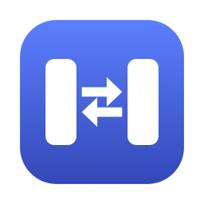
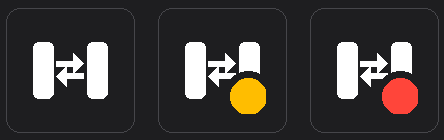

<p align="center">
  
</p>

# PresenceSync

[](LICENSE)


A menu-bar / system-tray app that keeps your **Microsoft Teams** presence and your
**Slack** status in sync, both directions, with browser sign-in and fully automatic
token refresh. macOS and Windows.

- **Teams → Slack:** in a Teams call or meeting → your Slack status reflects it; cleared when you're free.
- **Slack → Teams:** in a Slack huddle → your Teams presence goes **Busy** ("In a Slack huddle"); cleared when the huddle ends.
- **Health at a glance:** the tray icon shows a plain glyph when everything is running, an amber dot when something is degraded, and a red dot when action is needed.
- **No config files:** connect each service once in the browser; everything else is menu toggles and in-app windows. Tokens live in the OS keychain (macOS Keychain / Windows Credential Locker), never on disk.
- **Customisable:** edit the status text/emoji per Teams state and the huddle message from the Statuses window.

<p align="center">
  <br>
  <sub>Running &nbsp;·&nbsp; Attention &nbsp;·&nbsp; Action Needed</sub>
</p>

The two sync directions are deliberately built so they cannot feed each other — see
[`sync.py`](presencesync/core/sync.py) and [`tests/test_sync.py`](tests/test_sync.py).

---

## Prerequisites

PresenceSync talks to Microsoft Graph and the Slack API through **your own** app
registrations (there is no hosted service; your tokens never leave your machine):

1. **An Azure app registration** with delegated `Presence.Read` + `Presence.ReadWrite`
   (admin consent), public client flows enabled, and a `http://localhost` redirect URI.
2. **A Slack app** with user scopes `users.profile:read`, `users.profile:write`,
   `users:read` and the redirect URL `http://localhost:53682/callback`.

The bundled **Setup Guide** (tray icon → Setup Guide) walks through both step by step.
If someone in your organisation has already registered the apps, skip to
[Deploying to your organisation](#deploying-to-your-organisation).

---

## Install & run

### macOS
```bash
git clone https://github.com/jermainewalkes/presencesync.git
cd presencesync
bash setup.command        # or double-click it in Finder
```

### Windows
```bat
git clone https://github.com/jermainewalkes/presencesync.git
cd presencesync
setup.bat                 # or double-click it in Explorer
```

Both scripts create a virtual environment, install dependencies, and launch the app.
On first run the Settings window opens: enter your IDs, **Save**, then
**Connect Microsoft** and **Connect Slack** (each opens a browser sign-in).
Click **Test Connection** to confirm, and enable **Start at Login** from the menu.

Headless/dev usage:
```bash
./venv/bin/python main.py --once --dry-run   # show what one cycle would do
./venv/bin/python main.py --once             # one real cycle
./venv/bin/python main.py --status | --test  # connection checks
```

---

## Deploying to your organisation

An admin registers both apps **once**; every user shares the same four IDs:

- **Azure:** delegated permissions with tenant-wide admin consent mean any user in the
  tenant can sign in — no per-user consent prompts.
- **Slack:** one workspace app; each user runs the OAuth flow from PresenceSync and
  receives their own user token.

To onboard a colleague with zero manual entry, give them an `org-config.json`
(copy [`org-config.example.json`](org-config.example.json) and fill in the four
values). They drop it in the project folder before first run and the app seeds the
IDs automatically — all they do is click Connect.

Distribute `org-config.json` **internally only**: it contains your Slack client
secret. It is gitignored so it cannot be committed by accident.

---

## Where things live

| | macOS | Windows |
|---|---|---|
| Settings | `~/Library/Application Support/PresenceSync/` | `%LOCALAPPDATA%\PresenceSync\` |
| Logs | `presencesync.log` in the folder above | same |
| Secrets | Keychain | Credential Locker |
| Start at Login | LaunchAgent plist | `HKCU\...\Run` registry key |

## Troubleshooting

- **Red dot / "Reconnect Needed":** a token expired beyond refresh — open Settings and Connect again.
- **Slack sign-in fails immediately:** client ID/secret not saved, or the redirect URL is not exactly `http://localhost:53682/callback`.
- **Teams won't go Busy from a huddle:** confirm `Presence.ReadWrite` admin consent, and that you're signed into a Teams client.
- **Keychain prompts on macOS:** click Always Allow; that's where your tokens live.

## Development

```bash
./venv/bin/python -m unittest discover -s tests -v   # 43 tests, no network needed
```

Layout: [`presencesync/core`](presencesync/core) (engine, reconciler, API clients,
storage — platform-independent), [`presencesync/macos`](presencesync/macos) (rumps
menu-bar app), [`presencesync/windows`](presencesync/windows) (pystray tray app).

A native `.app` can be built on macOS with `pip install py2app && python setup.py py2app`.

## License

[MIT](LICENSE)
